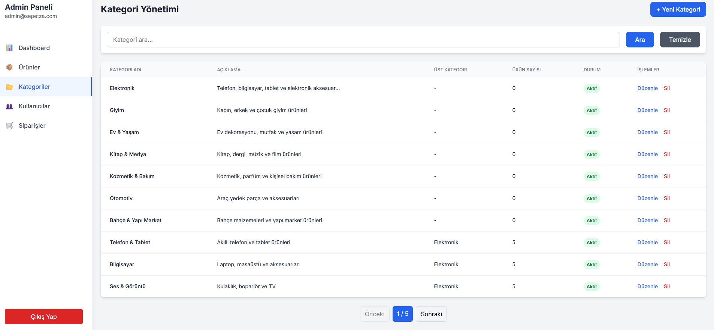

# 🛒 Sepetza E-Commerce Platform

A modern, secure, and user-friendly e-commerce platform built with .NET 9 Web API backend and React TypeScript frontend.


## ✨ Features

### 🛍️ Customer Features
- **Product Catalog**: Browse products by categories with advanced filtering
- **Advanced Search**: Search products by name, description, and category
- **Favorites**: Save favorite products for later
- **Shopping Cart**: Add, remove, and update product quantities
- **User Account**: Registration, login, and profile management
- **Product Reviews**: Rate and review products
- **Responsive Design**: Mobile and desktop compatible


### 🛒 Shopping Experience
- **Category Navigation**: Easy browsing through product categories
- **Product Details**: Comprehensive product information with images
- **Shopping Cart**: Seamless cart management with real-time updates
- **User Profile**: Complete profile management system


### 👨‍💼 Admin Panel
- **Dashboard**: Sales statistics and overview
- **Product Management**: CRUD operations, image upload, inventory tracking
- **Category Management**: Main categories and subcategories
- **User Management**: User list and status updates
- **Order Management**: Order tracking and status updates
- **File Upload**: Secure file handling for product images





## 🛠️ Technologies

### Backend (.NET 9 Web API)
- **Framework**: .NET 9.0
- **ORM**: Entity Framework Core
- **Database**: SQLite (Development), SQL Server (Production)
- **Authentication**: JWT Bearer Token
- **Validation**: FluentValidation
- **Caching**: In-Memory Cache
- **Rate Limiting**: Built-in Rate Limiting
- **File Upload**: Secure file handling
- **Architecture**: Clean Architecture (Core, Data, Business, API)

### Frontend (React TypeScript)
- **Framework**: React 18 with TypeScript
- **Styling**: Tailwind CSS
- **Routing**: React Router v6
- **HTTP Client**: Axios with interceptors
- **Form Handling**: React Hook Form
- **State Management**: React Context API
- **Icons**: Heroicons
- **Build Tool**: Create React App


## 📁 Project Structure

```
Sepetza/
├── backend/
│   ├── Sepetza.API/         # Web API Layer
│   │   ├── Controllers/     # API Controllers
│   │   ├── Middleware/      # Custom Middleware
│   │   └── wwwroot/         # Static Files
│   ├── Sepetza.Core/        # Domain Layer
│   │   ├── Entities/        # Domain Entities
│   │   ├── DTOs/            # Data Transfer Objects
│   │   ├── Interfaces/      # Repository & Service Interfaces
│   │   └── Constants/       # Application Constants
│   ├── Sepetza.Data/        # Data Access Layer
│   │   ├── Context/         # DbContext
│   │   ├── Repositories/    # Repository Implementations
│   │   ├── Migrations/      # EF Migrations
│   │   └── Seed/            # Data Seeding
│   └── Sepetza.Business/    # Business Logic Layer
│       └── Services/        # Service Implementations
├── frontend/
│   ├── src/
│   │   ├── components/      # Reusable Components
│   │   ├── pages/           # Page Components
│   │   ├── contexts/        # React Contexts
│   │   ├── services/        # API Services
│   │   ├── types/           # TypeScript Types
│   │   └── utils/           # Utility Functions
│   ├── public/              # Static Assets
│   └── package.json
├── Screenshots/             # Application Screenshots
└── README.md
```

## 🚀 Installation and Setup

### Prerequisites
- [.NET 9 SDK](https://dotnet.microsoft.com/download/dotnet/9.0)
- [Node.js](https://nodejs.org/) (v18 or higher)
- [Git](https://git-scm.com/)

### 1. Clone the Repository
```bash
git clone https://github.com/SametDulger/Sepetza.git
cd Sepetza
```

### 2. Backend Setup
```bash
cd backend/Sepetza.API
dotnet restore
dotnet run
```

Backend will run at: `https://localhost:7001`

### 3. Frontend Setup
```bash
cd frontend
npm install
npm start
```

Frontend will run at: `http://localhost:3000`

## 🔐 Default Admin Account

The system automatically creates an admin account on first run:

- **Email**: `admin@sepetza.com`
- **Password**: `Admin123!`

Access admin panel at: `http://localhost:3000/admin`


## 🖥️ User Interface

### Authentication
The platform provides secure user authentication with modern UI:


### User Features
Complete user experience with profile management, favorites, and order history:


## 🗄️ Database

The project uses SQLite database. On first run:
- Database is automatically created
- Sample categories and products are seeded
- Admin user is created

### Migration Commands
```bash
cd backend/Sepetza.API

# Create new migration
dotnet ef migrations add MigrationName

# Update database
dotnet ef database update

# Drop database
dotnet ef database drop
```

## 📝 API Endpoints

### Authentication
- `POST /api/auth/register` - User registration
- `POST /api/auth/login` - User login
- `GET /api/auth/me` - Current user information

### Products
- `GET /api/products` - Product list (with pagination)
- `GET /api/products/{id}` - Single product
- `GET /api/products/featured` - Featured products
- `GET /api/products/search` - Product search

### Categories
- `GET /api/categories` - Category list
- `GET /api/categories/{id}` - Single category
- `GET /api/categories/main` - Main categories

### Admin Endpoints
- `GET /api/admin/dashboard` - Dashboard data
- `GET /api/admin/products` - Admin product list
- `POST /api/admin/products` - Create product
- `PUT /api/admin/products/{id}` - Update product
- `DELETE /api/admin/products/{id}` - Delete product

## 🔒 Security Features

- **JWT Token Authentication**: Secure authentication system
- **Rate Limiting**: API request limiting
- **Input Validation**: All inputs are validated
- **File Upload Security**: Secure file upload handling
- **CORS Configuration**: Cross-origin request control
- **Password Hashing**: Secure password storage

## 🎨 UI/UX Features

- **Modern Design**: Clean and modern interface with Tailwind CSS
- **Responsive**: Compatible with all devices
- **Dark Mode Ready**: Infrastructure ready for easy theme switching
- **Loading States**: Loading indicators for better user experience
- **Error Handling**: User-friendly error messages
- **Toast Notifications**: Success and error notifications

## 🧪 Testing

```bash
# Backend tests
cd backend
dotnet test

# Frontend tests
cd frontend
npm test
```

## 📦 Production Build

### Backend
```bash
cd backend/Sepetza.API
dotnet publish -c Release -o ./publish
```

### Frontend
```bash
cd frontend
npm run build
```

## 🚀 Deployment

### Docker Deployment (Optional)
```bash
# Build and run with Docker Compose
docker-compose up --build
```

### Manual Deployment
1. Build both frontend and backend for production
2. Deploy backend to your preferred hosting service
3. Deploy frontend build to a static hosting service
4. Update API base URL in frontend configuration

## 🤝 Contributing

1. Fork the repository
2. Create a feature branch (`git checkout -b feature/amazing-feature`)
3. Commit your changes (`git commit -m 'Add amazing feature'`)
4. Push to the branch (`git push origin feature/amazing-feature`)
5. Open a Pull Request

## 📄 License

This project is licensed under the MIT License. See the [LICENSE](LICENSE) file for details.

## 📞 Contact

For questions about the project:

- GitHub Issues: [Issues](https://github.com/SametDulger/Sepetza/issues)

## 🔄 Version History

- **v1.0.0** - Initial stable release
  - Core e-commerce features
  - Admin panel
  - JWT authentication
  - Responsive design
  - File upload functionality
  - Complete CRUD operations

## 🙏 Acknowledgments

- Built with ❤️ using modern web technologies
- Icons by [Heroicons](https://heroicons.com/)
- Styling with [Tailwind CSS](https://tailwindcss.com/)

---

⭐ If you like this project, please give it a star! 
